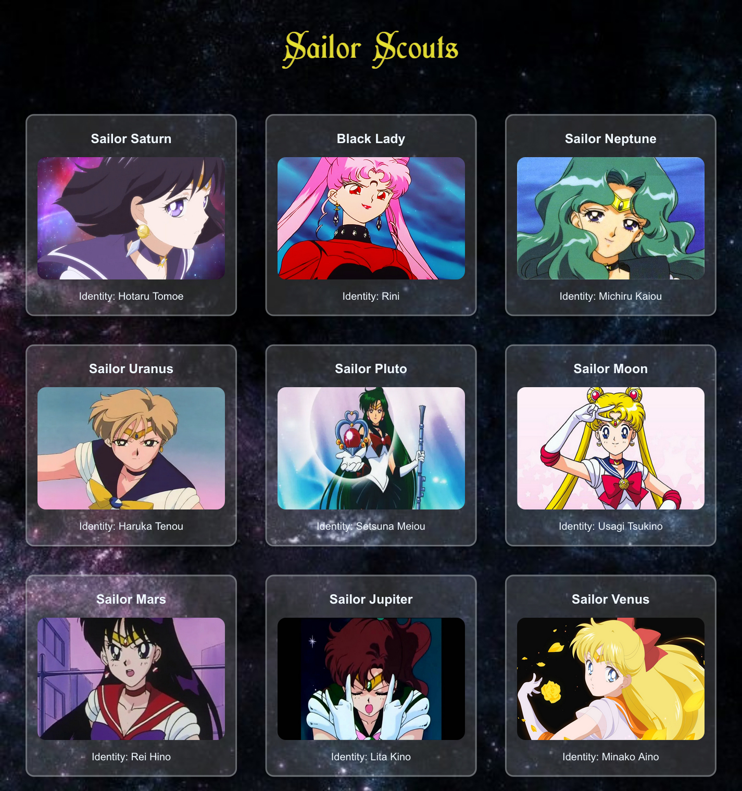

# Sailor Scouts 🌙

```
This is an old project that I took back just to practice React Test Basics
```

A little exercise to practice React \
This project shows my favorite sailor scouts using a fake api ✨

## Project setup 💫

```
git clone https://github.com/SolTuripe/sailor-moon-fav.git
cd sailor-moon-fav
npm install
```

## Page view 📷

<p align="center">

</p>

## In the project directory, you can run 🔮

### `npm start`

Runs the app in the development mode.\
Open [http://localhost:3000](http://localhost:3000) to view it in your browser.

The page will reload when you make changes.\
You may also see any lint errors in the console.

### `npm test`

Launches the test runner in the interactive watch mode.\
See the section about [running tests](https://facebook.github.io/create-react-app/docs/running-tests) for more information.

## Learn More 📚

You can learn more in the [Create React App documentation](https://facebook.github.io/create-react-app/docs/getting-started)

To learn React, check out the [React documentation](https://reactjs.org/)
